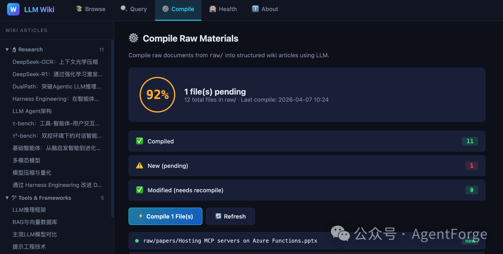
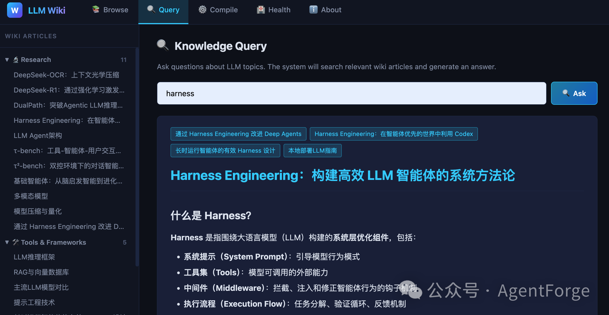

# LLM Wiki

> A personal knowledge base powered by LLMs — inspired by [Andrej Karpathy's LLM Knowledge Base](https://karpathy.ai) pattern.

LLM Wiki treats large language models as **knowledge compilers**: raw documents go in, structured and cross-referenced Markdown wiki articles come out. No vector databases, no embeddings — just files, LLMs, and Obsidian.

https://gist.github.com/karpathy/442a6bf555914893e9891c11519de94f

---

## Why LLM Wiki?

| | LLM Wiki | Traditional RAG |
|---|---|---|
| **Storage** | Structured Markdown | Vector database |
| **Knowledge accumulation** | Yes — wiki grows over time | No — stateless retrieval |
| **Transparency** | Fully human-readable | Opaque vectors |
| **Engineering complexity** | Low (files + LLM) | High (embeddings, indexing) |
| **Cross-references** | Obsidian `[[backlinks]]` | Implicit similarity |

---

## Features

- **Compile** — Transform PDFs, PPTX, DOCX, and Markdown into structured wiki articles with LLM-generated summaries and cross-references
- **Query** — Ask questions against your knowledge base; the LLM synthesizes answers from relevant wiki articles
- **Health Check** — Detect broken links, orphan articles, missing metadata, and knowledge gaps with a health score
- **Web UI** — Browse, query, compile, and inspect health from a FastAPI-powered web interface with real-time SSE streaming
- **Obsidian Integration** — Full `[[backlink]]` support; open the wiki directory directly in Obsidian
- **Multi-Provider LLM** — Works with OpenAI, Anthropic, Azure OpenAI, DeepSeek, Ollama (local), and any OpenAI-compatible API

---

## Quick Start

### 1. Setup

```bash
git clone <repo-url> llm-wiki && cd llm-wiki
bash scripts/setup.sh
```

The setup script automatically installs:
- Homebrew (macOS, if missing)
- `uv` package manager
- Python dependencies (openai, anthropic, rich, fastapi, uvicorn, jinja2, markitdown, pymupdf4llm)
- Ollama + model selection (llama3.1:8b / gemma4:e2b / gemma4:e4b)
- Obsidian (macOS, via Homebrew Cask)
- `.env` configuration template

### 2. Configure

Edit `.env` and add at least one LLM provider:

```bash
# OpenAI
OPENAI_API_KEY=sk-...
OPENAI_MODEL=gpt-4o

# Anthropic
ANTHROPIC_API_KEY=sk-ant-...
ANTHROPIC_MODEL=claude-sonnet-4-20250514

# Custom OpenAI-compatible (DeepSeek, Qwen, Moonshot, etc.)
CUSTOM_BASE_URL=https://api.deepseek.com/v1
CUSTOM_API_KEY=sk-...
CUSTOM_MODEL=deepseek-chat

# Azure OpenAI
AZURE_OPENAI_API_KEY=...
AZURE_OPENAI_ENDPOINT=https://xxx.openai.azure.com
AZURE_OPENAI_DEPLOYMENT=gpt-4o
AZURE_OPENAI_API_VERSION=2024-02-15-preview

# Ollama (local, no API key needed)
OLLAMA_BASE_URL=http://localhost:11434/v1
OLLAMA_MODEL=llama3.1:8b
```

Provider auto-detection priority: Custom > Anthropic > Azure > OpenAI > Ollama.

### 3. Add Documents

Place your source materials in `raw/`:

```
raw/
├── papers/    # Academic papers (.pdf)
├── articles/  # Blog posts, notes (.md, .txt)
├── repos/     # Code repository notes (.md)
└── images/    # Image resources
```

**Supported formats**: `.md` `.txt` `.pdf` `.pptx` `.ppt` `.docx` `.doc`

### 4. Compile

```bash
python3 scripts/compile.py                # Compile new files
python3 scripts/compile.py --all          # Force recompile everything
python3 scripts/compile.py --file doc.pdf # Compile a specific file
python3 scripts/compile.py --dry-run      # Preview without writing
python3 scripts/compile.py --ollama       # Use local Ollama
python3 scripts/compile.py --workers 8    # Parallel PDF extraction
```

### 5. Query

```bash
python3 scripts/query.py "What is the attention mechanism?"
python3 scripts/query.py --interactive          # Interactive chat mode
python3 scripts/query.py --save "Explain RLHF"  # Save answer to output/
python3 scripts/query.py --ollama "question"     # Use local Ollama
```

### 6. Health Check

```bash
python3 scripts/lint.py              # Run checks
python3 scripts/lint.py --report     # Generate detailed report
python3 scripts/lint.py --fix        # Auto-repair fixable issues
```

Checks include: broken `[[links]]`, orphan articles, missing metadata, knowledge gaps, INDEX coverage. Health score: 100 (perfect) to 0 (critical).

### 7. Web UI

```bash
python3 scripts/app.py
# Open http://localhost:8000
```

Panels: **Browse** (article tree + wiki link navigation) | **Query** (LLM Q&A) | **Compile** (real-time progress via SSE) | **Health** (one-click checks + auto-fix) | **About** (config info)




---

## Directory Structure

```
llm-wiki/
├── CLAUDE.md              # Agent configuration & rules
├── .env                   # LLM provider credentials
├── raw/                   # Source documents (user-managed, never edited by LLM)
│   ├── papers/
│   ├── articles/
│   ├── repos/
│   └── images/
├── wiki/                  # Compiled knowledge base (LLM-maintained)
│   ├── INDEX.md           # Master index of all articles
│   ├── LOG.md             # Evolution log
│   ├── concepts/          # Core concepts
│   ├── tools/             # Tools & frameworks
│   ├── research/          # Research frontiers
│   └── tutorials/         # Practical guides
├── output/                # Generated outputs
│   ├── queries/           # Saved Q&A results
│   ├── slides/            # Marp presentations
│   └── charts/            # Matplotlib visualizations
├── _meta/                 # Compile state tracking
│   └── compile_state.json
└── scripts/               # Core tooling
    ├── setup.sh           # Environment setup
    ├── compile.py         # Document compiler
    ├── query.py           # Knowledge base query
    ├── lint.py            # Health checks
    ├── app.py             # Web UI (FastAPI)
    ├── config.py          # Unified LLM config
    └── start.sh           # Web app launcher
```

---

## PDF Extraction

Multiple backends with automatic fallback:

| Priority | Backend | Strengths |
|---|---|---|
| 1 | pymupdf4llm | Best for tables and formulas |
| 2 | markitdown | Broad format compatibility |
| 3 | pdfminer | Pure text, minimal dependencies |
| 4 | pypdf | Lightweight fallback |

Large PDFs are automatically chunked (max 240KB per LLM request). Scanned PDFs are detected heuristically.

---

## Wiki Article Format

Every compiled article follows this structure:

```markdown
# Article Title

**Category**: concepts/tools/research/tutorials
**Last Updated**: 2025-04-05
**Related Articles**: [[Article A]], [[Article B]]
**Source**: source-file.pdf

---

## Overview
Brief 2-3 sentence summary.

## Core Content
Detailed sections organized with subsections.

## Key Points
- Point 1
- Point 2

## Further Reading
- [[Related Article]]

## Source References
- `raw/papers/source-file.pdf`
```

---

## Web API Endpoints

| Method | Endpoint | Description |
|---|---|---|
| `GET` | `/api/articles` | List all articles grouped by category |
| `GET` | `/api/articles/{category}/{name}` | Get single article content |
| `GET` | `/api/raw-files` | List raw files with compile status |
| `POST` | `/api/compile` | Trigger compilation (SSE stream) |
| `POST` | `/api/query` | Query the knowledge base |
| `GET` | `/api/health` | Run health check |
| `POST` | `/api/health/fix` | Auto-repair issues |
| `GET` | `/api/config` | Show current LLM configuration |

---

## Using with LLM Agents

LLM Wiki is designed to work with AI coding agents (Claude Code, Codex, etc.). The `CLAUDE.md` file provides the agent with:

- Project rules and conventions
- Session startup protocol
- Wiki article format specification
- Operation commands (compile, query, lint, enhance)
- Behavioral guidelines

```bash
cd llm-wiki
claude  # or your preferred LLM agent
# "Compile new files in raw/"
# "Query: What is RLHF?"
# "Run a health check"
```

---

## License

MIT

---

*Created by Steven Lian — inspired by Andrej Karpathy's LLM Knowledge Base pattern.*
